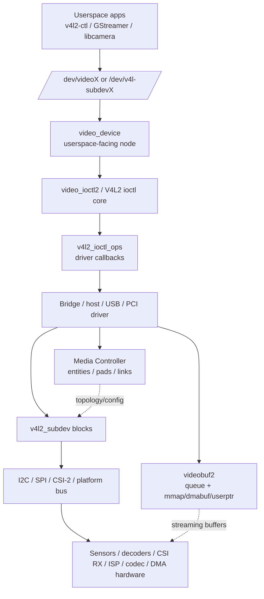
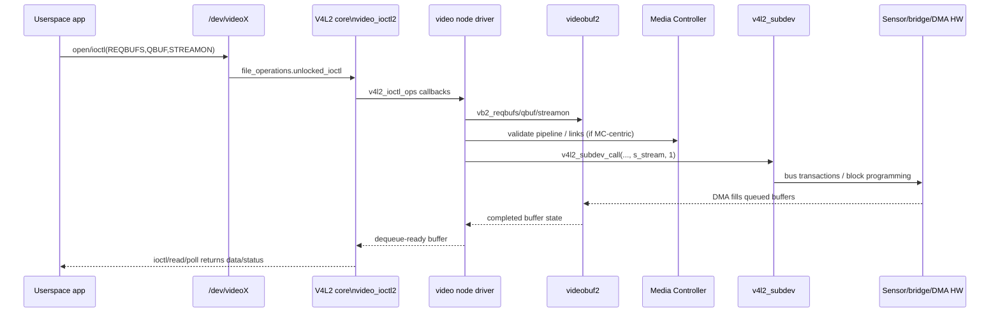

# V4L2 Layering and Communication Analysis

## What is being traced
- Topic: where V4L2 sits in the Linux kernel media stack, and how it communicates upward with userspace and downward with lower software/hardware layers.
- Sources used: in-tree Linux kernel code under `/home/xuefeiz2/linux`, plus Context7 and DeepWiki summaries for Linux kernel V4L2 documentation.
- Goal: produce a code-anchored explanation rather than a generic subsystem summary.

## Bottom line
V4L2 sits inside the kernel media subsystem as the userspace-facing video API framework, not as the hardware driver itself. In practice, userspace talks to a `video_device` node such as `/dev/videoX`; that node is managed by the V4L2 core, which dispatches ioctls into driver-specific `v4l2_ioctl_ops`, while the driver coordinates buffering through videobuf2 (`vb2`), pipeline topology through Media Controller when enabled, and hardware blocks through `v4l2_subdev` abstractions or direct DMA/bus operations.

A useful mental model is:

1. **Userspace API boundary**: `/dev/video*` and `/dev/v4l-subdev*`
2. **V4L2 core/framework**: `video_device`, `v4l2_device`, `video_ioctl2`, control/event/filehandle helpers
3. **Optional topology layer**: Media Controller entities / pads / links
4. **Streaming/buffer layer**: `videobuf2`
5. **Bridge/video-node drivers**: platform/PCI/USB host-side drivers
6. **Sub-device drivers**: sensors, decoders, CSI receivers, ISP blocks, codecs
7. **Physical communication/hardware**: I2C / SPI / CSI-2 / DMA / platform registers

## Where V4L2 sits in the tree
The top-level media Makefile shows the layering boundary clearly: Media Controller core is linked before `v4l2-core`, and real drivers are linked afterward.

**File:** `drivers/media/Makefile:14-33`
```make
# Now, let's link-in the media controller core
ifeq ($(CONFIG_MEDIA_CONTROLLER),y)
  obj-$(CONFIG_MEDIA_SUPPORT) += mc/
endif

obj-$(CONFIG_VIDEO_DEV) += v4l2-core/
...
# Finally, merge the drivers that require the core
obj-y += common/ platform/ pci/ usb/ mmc/ firewire/ spi/ test-drivers/
```

The `v4l2-core` Makefile shows what the V4L2 framework layer actually contains: device node management, ioctl dispatch, device/subdev registration, filehandle/event/control helpers, plus optional MC, async, fwnode and i2c glue.

**File:** `drivers/media/v4l2-core/Makefile:11-33`
```make
videodev-objs := v4l2-dev.o v4l2-ioctl.o v4l2-device.o v4l2-fh.o \
			 v4l2-event.o v4l2-subdev.o v4l2-common.o \
			 v4l2-ctrls-core.o v4l2-ctrls-api.o \
			 v4l2-ctrls-request.o v4l2-ctrls-defs.o

videodev-$(CONFIG_MEDIA_CONTROLLER) += v4l2-mc.o
videodev-$(CONFIG_VIDEO_V4L2_I2C) += v4l2-i2c.o

obj-$(CONFIG_V4L2_ASYNC) += v4l2-async.o
obj-$(CONFIG_V4L2_FWNODE) += v4l2-fwnode.o
obj-$(CONFIG_V4L2_MEM2MEM_DEV) += v4l2-mem2mem.o
```

## Core abstractions and their layer roles
The in-tree introduction document maps driver structure and framework structure almost one-to-one.

**File:** `Documentation/driver-api/media/v4l2-intro.rst:37-76`
```rst
All drivers have the following structure:
1) A struct for each device instance containing the device state.
2) A way of initializing and commanding sub-devices (if any).
3) Creating V4L2 device nodes (/dev/videoX, /dev/vbiX and /dev/radioX)
4) Filehandle-specific structs containing per-filehandle data;
5) video buffer handling.
...
The framework closely resembles the driver structure: it has a v4l2_device
struct for the device instance data, a v4l2_subdev struct to refer to
sub-device instances, the video_device struct stores V4L2 device node data
and the v4l2_fh struct keeps track of filehandle instances.
```

### `struct v4l2_device`: per-device container
`v4l2_device` is the device-level coordination object. It groups subdevices, optional media_device integration, controls, notifications and lifetime.

**File:** `include/media/v4l2-device.h:21-59`
```c
struct v4l2_device {
	struct device *dev;
	struct media_device *mdev;
	struct list_head subdevs;
	spinlock_t lock;
	char name[V4L2_DEVICE_NAME_SIZE];
	void (*notify)(struct v4l2_subdev *sd,
			unsigned int notification, void *arg);
	struct v4l2_ctrl_handler *ctrl_handler;
	struct v4l2_prio_state prio;
	struct kref ref;
	void (*release)(struct v4l2_device *v4l2_dev);
};
```

### `struct video_device`: userspace-facing V4L2 node
`video_device` is the object that becomes `/dev/videoX`, `/dev/radioX`, `/dev/v4l-subdevX`, and similar nodes.

**File:** `include/media/v4l2-dev.h:222-257`
```c
struct video_device {
	...
	struct v4l2_file_operations *fops;
	struct device dev;
	struct cdev *cdev;
	struct v4l2_device *v4l2_dev;
	...
	struct vb2_queue *queue;
	...
	void (*release)(struct video_device *vdev);
	const struct v4l2_ioctl_ops *ioctl_ops;
	...
};
```

### `struct v4l2_subdev`: hardware-block abstraction
`v4l2_subdev` models hardware blocks below the video node layer: sensors, decoders, muxes, CSI receivers, scalers, codecs, flash/lens helpers, etc. The subdev document explicitly describes these as bus-connected helper devices, often I2C.

**File:** `Documentation/driver-api/media/v4l2-subdev.rst:6-23`
```rst
Many drivers need to communicate with sub-devices.
... most commonly they handle audio and/or video muxing,
encoding or decoding. For webcams common sub-devices are sensors and camera
controllers.

Usually these are I2C devices, but not necessarily.
```

**File:** `include/media/v4l2-subdev.h:60-87`
```c
/*
 * Sub-devices are devices that are connected somehow to the main bridge
 * device. These devices are usually audio/video muxers/encoders/decoders or
 * sensors and webcam controllers.
 *
 * Usually these devices are controlled through an i2c bus, but other buses
 * may also be used.
 */
```

### `videobuf2`: streaming and buffer layer
`videobuf2` is not the userspace API layer. It is the standard buffer queue and streaming state-machine layer used by many V4L2 drivers.

**File:** `include/media/videobuf2-v4l2.h:77-145`
```c
int vb2_reqbufs(struct vb2_queue *q, struct v4l2_requestbuffers *req);
int vb2_prepare_buf(struct vb2_queue *q, struct media_device *mdev,
		    struct v4l2_buffer *b);
int vb2_qbuf(struct vb2_queue *q, struct media_device *mdev,
	     struct v4l2_buffer *b);
...
int vb2_streamon(struct vb2_queue *q, enum v4l2_buf_type type);
int vb2_streamoff(struct vb2_queue *q, enum v4l2_buf_type type);
```

## Upward communication: how userspace reaches V4L2

### Step 1: ioctl syscall enters VFS
The generic kernel path is `ioctl()` -> `do_vfs_ioctl()` -> `vfs_ioctl()` -> file `unlocked_ioctl`.

**File:** `fs/ioctl.c:44-56`
```c
long vfs_ioctl(struct file *filp, unsigned int cmd, unsigned long arg)
{
	int error = -ENOTTY;

	if (!filp->f_op->unlocked_ioctl)
		goto out;

	error = filp->f_op->unlocked_ioctl(filp, cmd, arg);
	...
}
```

**File:** `fs/ioctl.c:856-870`
```c
SYSCALL_DEFINE3(ioctl, unsigned int, fd, unsigned int, cmd, unsigned long, arg)
{
	...
	error = do_vfs_ioctl(f.file, fd, cmd, arg);
	if (error == -ENOIOCTLCMD)
		error = vfs_ioctl(f.file, cmd, arg);
	...
}
```

### Step 2: V4L2 registers a character device node
The V4L2 core turns `video_device` objects into device nodes under major 81. It selects names such as `video`, `radio`, and `v4l-subdev`.

**File:** `include/media/v4l2-dev.h:22-42`
```c
#define VIDEO_MAJOR	81

enum vfl_devnode_type {
	VFL_TYPE_VIDEO,
	VFL_TYPE_VBI,
	VFL_TYPE_RADIO,
	VFL_TYPE_SUBDEV,
	VFL_TYPE_SDR,
	VFL_TYPE_TOUCH,
	VFL_TYPE_MAX
};
```

**File:** `drivers/media/v4l2-core/v4l2-dev.c:880-923`
```c
int __video_register_device(struct video_device *vdev,
			    enum vfl_devnode_type type,
			    int nr, int warn_if_nr_in_use,
			    struct module *owner)
{
	...
	switch (type) {
	case VFL_TYPE_VIDEO:
		name_base = "video";
		break;
	...
	case VFL_TYPE_SUBDEV:
		name_base = "v4l-subdev";
		break;
```

The same function wires the core character-device file operations.

**File:** `drivers/media/v4l2-core/v4l2-dev.c:1016-1037`
```c
	/* Part 3: Initialize the character device */
	vdev->cdev = cdev_alloc();
	...
	vdev->cdev->ops = &v4l2_fops;
	...
	/* Part 4: register the device with sysfs */
	vdev->dev.class = &video_class;
	vdev->dev.devt = MKDEV(VIDEO_MAJOR, vdev->minor);
	dev_set_name(&vdev->dev, "%s%d", name_base, vdev->num);
```

### Step 3: most V4L2 drivers point `unlocked_ioctl` to `video_ioctl2`
Representative drivers consistently expose a V4L2 file-ops table whose `unlocked_ioctl` is the V4L2 core dispatcher.

**File:** `drivers/media/usb/uvc/uvc_v4l2.c:1592-1602`
```c
const struct v4l2_file_operations uvc_fops = {
	.owner		= THIS_MODULE,
	.open		= uvc_v4l2_open,
	.release	= uvc_v4l2_release,
	.unlocked_ioctl	= video_ioctl2,
	.read		= uvc_v4l2_read,
	.mmap		= uvc_v4l2_mmap,
	.poll		= uvc_v4l2_poll,
};
```

**File:** `drivers/media/platform/st/stm32/stm32-dcmi.c:1550-1561`
```c
static const struct v4l2_file_operations dcmi_fops = {
	.owner		= THIS_MODULE,
	.unlocked_ioctl	= video_ioctl2,
	.open		= dcmi_open,
	.release	= dcmi_release,
	.poll		= vb2_fop_poll,
	.mmap		= vb2_fop_mmap,
	.read		= vb2_fop_read,
};
```

### Step 4: `video_ioctl2()` dispatches into the driver's ioctl table
The V4L2 core does the argument marshalling and then routes the request into the specific `v4l2_ioctl_ops` callbacks provided by the driver.

**File:** `drivers/media/v4l2-core/v4l2-ioctl.c:3438-3442`
```c
long video_ioctl2(struct file *file,
	       unsigned int cmd, unsigned long arg)
{
	return video_usercopy(file, cmd, arg, __video_do_ioctl);
}
```

For STM32 DCMI, the ioctl table shows exactly where standard V4L2 commands land.

**File:** `drivers/media/platform/st/stm32/stm32-dcmi.c:1515-1548`
```c
static const struct v4l2_ioctl_ops dcmi_ioctl_ops = {
	.vidioc_querycap		= dcmi_querycap,
	...
	.vidioc_reqbufs			= vb2_ioctl_reqbufs,
	.vidioc_create_bufs		= vb2_ioctl_create_bufs,
	.vidioc_querybuf		= vb2_ioctl_querybuf,
	.vidioc_qbuf			= vb2_ioctl_qbuf,
	.vidioc_dqbuf			= vb2_ioctl_dqbuf,
	.vidioc_expbuf			= vb2_ioctl_expbuf,
	.vidioc_prepare_buf		= vb2_ioctl_prepare_buf,
	.vidioc_streamon		= vb2_ioctl_streamon,
	.vidioc_streamoff		= vb2_ioctl_streamoff,
};
```

This shows the upward path precisely: userspace does not talk to sensors or DMA directly. It talks to a `video_device`; the V4L2 core validates and dispatches; then the bridge/video driver decides what lower layers to invoke.

## Downward communication: how V4L2 reaches lower layers

### Path A: downward into vb2 for buffer and streaming control
`vb2_ioctl_*` and `vb2_fop_*` helpers sit between V4L2 ioctl/file operations and the buffer queue engine.

**File:** `drivers/media/common/videobuf2/videobuf2-v4l2.c:1-3`
```c
/*
 * videobuf2-v4l2.c - V4L2 driver helper framework
 */
```

**File:** `include/media/videobuf2-v4l2.h:123-145`
```c
int vb2_qbuf(struct vb2_queue *q, struct media_device *mdev,
	     struct v4l2_buffer *b);
...
 * #) if streaming is on, queues the buffer in driver by the means of
 *    &vb2_ops->buf_queue callback for processing.
```

So `VIDIOC_REQBUFS`, `VIDIOC_QBUF`, `VIDIOC_STREAMON`, `VIDIOC_DQBUF`, `mmap()`, `poll()`, and `read()` commonly go through vb2 before the hardware-specific driver callbacks run.

### Path B: downward into media pipeline / sub-device graph
For graph-based camera pipelines, the host capture driver may walk upstream entities and call `v4l2_subdev_call(..., s_stream, state)` on each subdevice.

**File:** `drivers/media/platform/st/stm32/stm32-dcmi.c:702-716`
```c
/* Start/stop all entities within pipeline */
while (1) {
	...
	if (!pad || !is_media_entity_v4l2_subdev(pad->entity))
		break;
	...
	subdev = media_entity_to_v4l2_subdev(entity);

	ret = v4l2_subdev_call(subdev, video, s_stream, state);
```

And this is done from the driver's streaming start path after media-pipeline start:

**File:** `drivers/media/platform/st/stm32/stm32-dcmi.c:740-763`
```c
static int dcmi_start_streaming(struct vb2_queue *vq, unsigned int count)
{
	...
	ret = video_device_pipeline_start(dcmi->vdev, &dcmi->pipeline);
	if (ret < 0)
		...

	ret = dcmi_pipeline_start(dcmi);
	if (ret)
		goto err_media_pipeline_stop;
```

This is the clearest example of V4L2 sitting above subdevices: the video node driver owns the user-visible capture endpoint, while the actual upstream blocks are started through subdev calls.

### Path C: downward into sensor/bus-level register IO
A concrete subdevice driver like OV5640 implements `.s_stream` and then performs bus-level programming through I2C transfers.

**File:** `drivers/media/i2c/ov5640.c:3690-3726`
```c
static int ov5640_s_stream(struct v4l2_subdev *sd, int enable)
{
	...
	if (sensor->streaming == !enable) {
		if (enable && sensor->pending_mode_change) {
			ret = ov5640_set_mode(sensor);
			...
		}
		...
		if (ov5640_is_csi2(sensor))
			ret = ov5640_set_stream_mipi(sensor, enable);
		else
			ret = ov5640_set_stream_dvp(sensor, enable);
```

The actual register write goes over I2C:

**File:** `drivers/media/i2c/ov5640.c:1179-1199`
```c
static int ov5640_write_reg(struct ov5640_dev *sensor, u16 reg, u8 val)
{
	...
	msg.addr = client->addr;
	msg.flags = client->flags;
	msg.buf = buf;
	msg.len = sizeof(buf);

	ret = i2c_transfer(client->adapter, &msg, 1);
	if (ret < 0) {
		dev_err(&client->dev, "%s: error: reg=%x, val=%x\n",
			__func__, reg, val);
```

So the fully expanded downward chain is often:

`video node driver -> v4l2_subdev_call(sd, video, s_stream, ...) -> sensor subdev .s_stream -> bus transaction helpers -> I2C/SPI/CSI/platform register writes`

## Media Controller and async discovery
V4L2 can work in simpler node-centric setups, but complex camera pipelines are often MC-centric. In that mode, entities/pads/links are not just descriptive; they shape control/configuration flow.

The userspace subdevice document makes that explicit.

**File:** `Documentation/userspace-api/media/v4l/dev-subdev.rst:15-24`
```rst
V4L2 sub-devices are usually kernel-only objects. If the V4L2 driver
implements the media device API, they will automatically inherit from
media entities. Applications will be able to enumerate the sub-devices
and discover the hardware topology using the media entities, pads and
links enumeration API.
```

Subdevices can also get their own device nodes when requested by the bridge/device.

**File:** `drivers/media/v4l2-core/v4l2-device.c:196-223`
```c
/* Register a device node for every subdev marked with the
 * V4L2_SUBDEV_FL_HAS_DEVNODE flag.
 */
...
	vdev->fops = &v4l2_subdev_fops;
	...
	err = __video_register_device(vdev, VFL_TYPE_SUBDEV, -1, 1,
				      sd->owner);
```

Async matching binds discovered subdevices to the host `v4l2_device`.

**File:** `drivers/media/v4l2-core/v4l2-async.c:314-338`
```c
static int v4l2_async_match_notify(struct v4l2_async_notifier *notifier,
				   struct v4l2_device *v4l2_dev,
				   struct v4l2_subdev *sd,
				   struct v4l2_async_subdev *asd)
{
	...
	ret = v4l2_device_register_subdev(v4l2_dev, sd);
	...
	ret = v4l2_async_create_ancillary_links(notifier, sd);
```

And a real bridge driver like Intel IPU3 CIO2 shows the async notifier pattern and subsequent media-link creation.

**File:** `drivers/media/pci/intel/ipu3/ipu3-cio2-main.c:1414-1446`
```c
static int cio2_notifier_complete(struct v4l2_async_notifier *notifier)
{
	...
	ret = media_create_pad_link(&q->sensor->entity, ret,
				    &q->subdev.entity, CIO2_PAD_SINK,
				    0);
	...
	return v4l2_device_register_subdev_nodes(&cio2->v4l2_dev);
}
```

This is why MC-centric systems shift part of the control path from “single node owns everything” to “pipeline graph must be known and validated first”. Streaming still terminates at a video node, but pipeline configuration is graph-aware.

## Representative communication models

### 1. Legacy / simpler node-centric V4L2
- Userspace opens `/dev/videoX`
- ioctls go to `video_ioctl2`
- driver implements monolithic `v4l2_ioctl_ops`
- driver may directly program hardware or call a few embedded subdevices
- Media Controller may be absent

### 2. MC-centric camera pipeline
- Userspace and/or framework configures topology-aware pipeline
- video node driver owns userspace endpoint
- bridge driver registers and coordinates subdevices
- `video_device_pipeline_start()` validates / activates path
- driver invokes `v4l2_subdev_call()` across upstream entities
- subdevices program sensors/CSI receivers/ISP blocks over bus-specific mechanisms

### 3. Streaming/buffer path
- `REQBUFS/QBUF/STREAMON` enter via V4L2 ioctl layer
- dispatched into `vb2_ioctl_*`
- vb2 queue state machine hands work to driver `vb2_ops`
- driver starts pipeline and DMA
- completed buffers propagate back through vb2 to `DQBUF` / `poll` / `read`

## Mermaid diagrams

### 1. Layer map


### 2. Upward/downward communication path


## Key takeaways
- V4L2 is the **userspace-facing kernel media API framework**, not the hardware block driver.
- `video_device` is the upward-facing endpoint; `v4l2_device` is the per-device container; `v4l2_subdev` is the downward-facing hardware-block abstraction.
- `video_ioctl2()` is the common ioctl dispatch hub for many drivers.
- `videobuf2` is the queueing/streaming engine that many V4L2 drivers rely on.
- With Media Controller enabled, topology becomes part of the control path, not just passive metadata.
- The actual lowest layer is still bus/DMA/register programming in sensor, bridge, codec, or host-interface drivers.

## Source checklist
Primary in-tree files used in this analysis:
- `drivers/media/Makefile`
- `drivers/media/v4l2-core/Makefile`
- `drivers/media/v4l2-core/v4l2-dev.c`
- `drivers/media/v4l2-core/v4l2-ioctl.c`
- `drivers/media/v4l2-core/v4l2-device.c`
- `drivers/media/v4l2-core/v4l2-subdev.c`
- `drivers/media/v4l2-core/v4l2-async.c`
- `drivers/media/common/videobuf2/videobuf2-v4l2.c`
- `include/media/v4l2-device.h`
- `include/media/v4l2-dev.h`
- `include/media/v4l2-subdev.h`
- `include/media/videobuf2-v4l2.h`
- `drivers/media/platform/st/stm32/stm32-dcmi.c`
- `drivers/media/i2c/ov5640.c`
- `drivers/media/pci/intel/ipu3/ipu3-cio2-main.c`
- `drivers/media/usb/uvc/uvc_v4l2.c`
- `Documentation/driver-api/media/v4l2-intro.rst`
- `Documentation/driver-api/media/v4l2-subdev.rst`
- `Documentation/userspace-api/media/v4l/dev-subdev.rst`

External corroboration used for narrative alignment:
- Context7 Linux kernel docs summary on V4L2 architecture and subdevice model
- DeepWiki Linux kernel summary on V4L2 placement and communication paths
